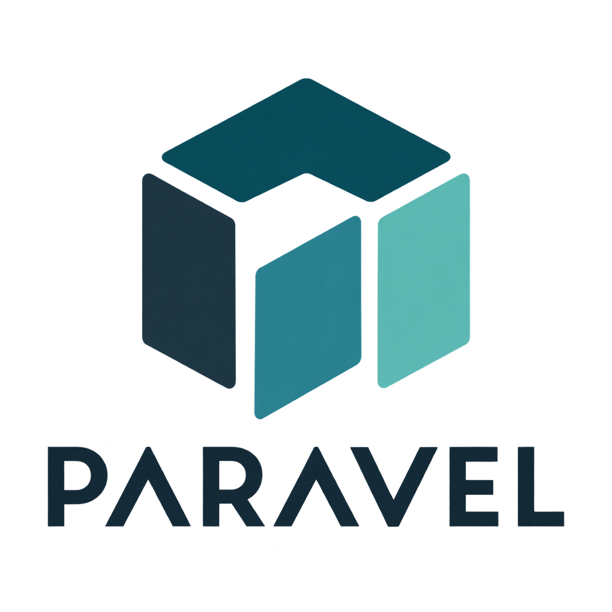

<p align="center">
  
</p>

# Paravel

**Workplace de tus workplaces.**

Paravel es una aplicación de escritorio para dar sitio a proyectos, investigaciones y productos. Un **espacio** reúne las piezas que ya usas — editor, carpeta, web, grupo de Firefox — las marcas, y las inicias juntas. Los nombres concretos (un repo, un curso, una startup) son inquilinos. El producto es el espacio.

Funciona sin bot. MCP es una tubería de lectura hacia una mesa, no el menú ni el eje de la app.

## El modelo

```text
Paravel
  Grupo            estante (Trabajo, Universidad, …)
    Espacio        un proyecto o una investigación
      Piezas       Cursor / VS Code, carpeta, archivo, web, Firefox
      Iniciar      play sobre lo marcado
      Pack         qué puede leer un bot invitado (opcional)
```

Un solo linaje. Se replica: muchos grupos, muchos espacios, las mismas reglas.

| | Es | No es |
| --- | --- | --- |
| **Paravel** | Workplace de tus espacios | Un launcher, un IDE o otro Notion |
| **Espacio** | Sitio de un proyecto | Un atajo a una aplicación |
| **Pieza** | Superficie que se abre | Un plugin de marketplace |
| **Iniciar** | Play de la selección | El clic que entra al espacio |
| **MCP** | Lectura acotada de una mesa | El producto |

Entrar, marcar, iniciar. El resto es mantenimiento.

## Estado

Prototipo Windows. Tauri v2, React y Rust. El crate nativo se llama todavía `launch-host` (kit de spawn). Versión `0.1.0`.

## Compilar

Requisitos: Node.js 22+, Rust 1.88+, herramientas C++ MSVC y Windows SDK.

```powershell
cd app
npm install
npm run tauri dev
```

Los datos locales viven en `%APPDATA%\app.paravel.desktop\` (`paravel.sqlite3`, `settings.json`, `launch.log`). Carpetas extra y rutas de `Code.exe` / `Cursor.exe` / `firefox.exe` se configuran en la app, en **Este equipo**. No se versionan.

Si ya tienes una base de una instalación anterior, cópiala a esa carpeta o define `PARAVEL_IMPORT_DB` una vez hacia el archivo viejo.

## Uso

1. Crea un grupo y un espacio, o usa una plantilla (vacío, desarrollo, investigación, cliente).
2. Añade piezas: editor, carpeta, archivo, URLs, o un grupo de Firefox.
3. Marca lo que debe abrirse. **Iniciar** lanza solo la selección.
4. Opcional: guarda un **pack** con las piezas que un cliente MCP puede leer. Sin pack, el bot no ve la mesa; la nota del espacio sí viaja si el servidor está encendido.

El frontend no ejecuta shell. Rust valida rutas (`canonicalize`, roots permitidos), arma argv, escribe un log append-only y spawnea el `.exe`. Un `file` se abre con el handler del sistema; no se lanzan ejecutables, atajos ni scripts.

## MCP

`paravel-mcp` es un servidor de **solo lectura**. Abre la SQLite en modo read-only, sin migraciones y sin seguir paths ni URLs. Tres herramientas: `leer_espacio`, `listar_piezas`, `leer_contexto_pieza`. El ámbito es un UUID de espacio y las filas de `pack_pieza`.

- Stdio: el cliente lanza el binario con `--db` y `--espacio`. No hay autenticación; la frontera de confianza es el equipo y la configuración del cliente.
- HTTP: experimental (loopback, OAuth 2.1 + PKCE, frase de operador en un archivo **fuera** del repo).

Guía: [`app/crates/paravel-mcp/README.md`](app/crates/paravel-mcp/README.md). Plantilla: [`cursor-mcp.example.json`](app/crates/paravel-mcp/cursor-mcp.example.json). No commitees rutas reales ni UUIDs.

## Documentación

| | |
| --- | --- |
| Tesis de producto | [`docs/producto/PRODUCTO.md`](docs/producto/PRODUCTO.md) |
| Arquitectura | [`docs/arquitectura/ARQUITECTURA.md`](docs/arquitectura/ARQUITECTURA.md) |
| Modelo de datos | [`docs/arquitectura/MODELO.md`](docs/arquitectura/MODELO.md) |
| Host de spawn | [`docs/arquitectura/CAPAS.md`](docs/arquitectura/CAPAS.md) |
| Pack de mesa | [`docs/pack/PACK.md`](docs/pack/PACK.md) |
| Desarrollo de la app | [`app/README.md`](app/README.md) |
| Contribuir | [`CONTRIBUTING.md`](CONTRIBUTING.md) |
| Seguridad | [`SECURITY.md`](SECURITY.md) |

## Repositorio

| Ruta | Rol |
| --- | --- |
| `app/` | App Tauri + React |
| `app/src-tauri/` | Host nativo (spawn, SQLite, captura, plantillas) |
| `app/crates/paravel-context/` | Modelo de lectura compartido |
| `app/crates/paravel-mcp/` | Servidor MCP de solo lectura |
| `assets/` | Marca (logo) |
| `docs/` | Producto, arquitectura y planificación |
| `packs/` | Ejemplo sintético de pack |

`reports/`, `target/`, `node_modules/`, bases SQLite y secretos de operador no se publican.

## Pruebas

```powershell
npm.cmd --prefix app run build
cargo test --locked --manifest-path app/crates/paravel-context/Cargo.toml
cargo test --locked --manifest-path app/crates/paravel-mcp/Cargo.toml
cargo test --locked --manifest-path app/src-tauri/Cargo.toml
```

Los harness nativos bajo `app/scripts/*-native.test.mjs` requieren un build debug y Playwright. Usan el directorio temporal del sistema (`PARAVEL_TEST_TEMP` para aislarlos). Las suites MCP usan fixtures sintéticas, nunca la base personal.

## Licencia

[MIT](LICENSE)

## Seguridad

Paravel guarda la mesa en el equipo del operador. El servidor MCP no escribe la base ni abre lo que hay en los payloads.

No abras issues públicos para secretos, bypass de auth o exfiltración. Usa [reporte privado de GitHub](https://docs.github.com/en/code-security/security-advisories/guidance-on-reporting-and-writing-information-about-vulnerabilities/privately-reporting-a-security-vulnerability). Detalle en [`SECURITY.md`](SECURITY.md).
